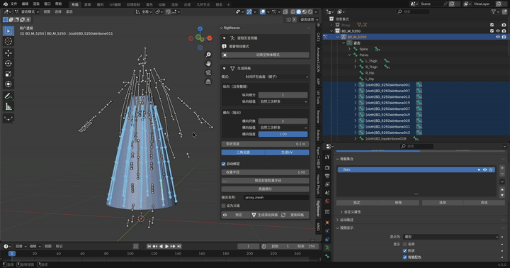
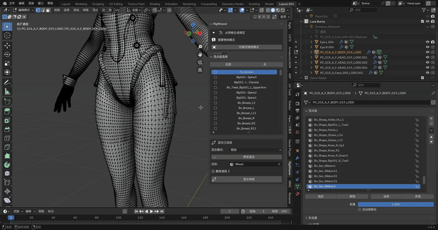

# RigWeaver

Bone extraction and simulation proxy mesh tools for Blender.

RigWeaver helps you:

- extract only deforming bones into a clean reduced armature,
- generate or update proxy meshes from selected pose-bone chains,
- generate/update a cage rig from mesh,
- multi-select and mix vertex groups faster.

---

## English

### 1. Requirements

- Blender 4.5.0+
- RigWeaver extension package (`RigWeaver_v<version>.zip`)
- Optional: NumPy (needed for some AUTO/TREE features)
- Optional: GPU support for viewport preview overlays

### 2. Install

1. Build package:
   - Run `./build.ps1` in repo root (PowerShell).
2. Install in Blender:
   - `Edit > Preferences > Extensions > Install from File`
   - Select generated zip: `RigWeaver_v<version>.zip`.
   - Or drag and drop the `RigWeaver_v<version>.zip` into view port.
3. Open `3D Viewport > Sidebar (N) > RigWeaver`.

Note:

- The build script derives the zip base name from `blender_manifest.toml` `name`, then normalises non-alphanumeric characters to `_`.

### 3. Main Workflows

#### A. Extract Deforming Bones (Armature, Object Mode)

1. Select an armature.
2. In `RigWeaver > Extract Deforming Bones`:
   - optional: `Retarget Meshes`
   - optional: `Auto Bone Orientation`
   - optional: `Connect Child Bones`
3. Click `Extract Deforming Bones`.

Result:

- Creates a reduced armature with only actually weighted/deforming bones.

#### B. Generate Proxy Mesh (Armature, Pose Mode)

1. Select armature, switch to Pose Mode.
2. Select pose bones/chains.
3. In `RigWeaver > Generate Mesh`, set:
   - `Mode` (Individual / Surface / Loop / Auto-Split / Tree)
   - longitudinal/lateral interpolation and resolution options
   - optional `Auto-Rig`, `Generate UVs`, `Subdivision Surface`
4. Click `Preview` to iterate.
5. Click `Generate Proxy Mesh` to commit, or `Update Mesh` to regenerate existing proxy.
6. Click `Discard Preview` to remove wireframe preview manually.

Result:

- Generates low-poly proxy geometry for simulation or rig workflows.

#### C. Generate Rig from Mesh (Mesh, Object Mode)

1. Select mesh object.
2. In `RigWeaver > Generate Rig from Mesh`, set:
   - `Chains`
   - `Bones per Chain`
   - `Up Axis` (`AUTO` requires NumPy)
   - optional weights/parent options
3. Click `Preview Rig`.
4. Click `Generate Rig` or `Update Rig`.

Result:

- Builds/updates a radial cage armature from mesh shape.

#### D. Vertex Group Select + Mix (Mesh, Edit/Weight Paint)

1. Select mesh with vertex groups.
2. Enter Edit Mode.
3. In `Vertex Group Select`, check groups, set:
   - `Blend Mode`
   - `Target`
   - `Remove Source Groups`
4. Click `Preview Mix` (enters Weight Paint preview).
5. Click `Mix into Group` to commit.

Result:

- Quickly combines multiple groups into one target group.

### 4. GIF Walkthrough Slots (docs/media)

#### Proxy Preview -> Generate Cycle


#### Proxy Update Cycle



#### Rig From Mesh Preview -> Generate/Update


#### Vertex Group Preview Mix -> Commit



### 5. Mode/Context Requirements

- `Extract Deforming Bones`: active object must be Armature in Object Mode.
- `Generate Mesh` / `Preview Mesh` / `Update Mesh`: Armature in Pose Mode with selected pose bones.
- `Generate Rig from Mesh`: active object must be Mesh in Object Mode.
- `Vertex Group Select`: Mesh in Edit Mode or Weight Paint Mode.

### 6. NumPy/GPU Notes

- NumPy is required for:
  - `Tree` mesh mode in proxy generation,
  - `AUTO` up-axis in rig-from-mesh.
- GPU preview availability affects overlay preview operators.

### 7. Project Structure

```python
.
├─ __init__.py
├─ blender_manifest.toml
├─ build.ps1
├─ translations.py
├─ operators/
│  ├─ extract_ops.py
│  ├─ mesh_gen_ops.py
│  ├─ rig_from_mesh_ops.py
│  └─ vg_select_ops.py
└─ ui/
   └─ panel.py
```

---

## 中文

### 1. 环境要求

- Blender 4.5.0+
- RigWeaver 扩展包（`RigWeaver_v<version>.zip`）
- 可选：NumPy（部分 AUTO/TREE 功能需要）
- 可选：GPU 预览叠加支持

### 2. 安装

1. 打包：
   - 在仓库根目录运行 `./build.ps1`（PowerShell）。
2. 在 Blender 安装：
   - `编辑 > 偏好设置 > 扩展 > 从文件安装`
   - 选择生成的 zip：`RigWeaver_v<version>.zip`。
   - 或者拖拽`RigWeaver_v<version>.zip`到 Blender。
3. 打开 `3D 视图 > 侧边栏(N) > RigWeaver`。

说明：

- 构建脚本会从 `blender_manifest.toml` 的 `name` 字段生成 zip 名称，并将非字母数字字符规范化为 `_`。

### 3. 核心流程

#### A. 提取形变骨骼（骨架对象，物体模式）

1. 选中骨架对象。
2. 在 `RigWeaver > 提取形变骨骼` 中按需设置：
   - `重定向网格绑定`
   - `自动骨骼朝向`
   - `连接子骨骼`
3. 点击 `提取形变骨骼`。

结果：

- 生成仅包含实际参与权重变形骨骼的精简骨架。

#### B. 生成简化网格（骨架对象，姿态模式）

1. 选中骨架并切换到姿态模式。
2. 选择骨骼/骨骼链。
3. 在 `RigWeaver > 生成网格` 设置：
   - `模式`（独立条带 / 连接曲面 / 封闭环形 / 自动分割 / 树状）
   - 纵向/横向插值与分辨率
   - 可选 `自动绑定`、`生成UV`、`细分曲面`
4. 点击 `预览` 反复预览。
5. 点击 `生成简化网格` 提交，或 `更新网格` 更新现有网格。
6. 需要时点击 `退出预览` 手动退出线框预览。

结果：

- 生成用于模拟或绑定流程的低模简化网格。

#### C. 从网格生成绑定（网格对象，物体模式）

1. 选中网格对象。
2. 在 `RigWeaver > 从网格生成绑定` 设置：
   - `骨骼链数量`
   - `每链骨骼数`
   - `上方朝向轴`（自动模式需要 NumPy）
   - 自动权重/父子关系
3. 点击 `预览绑定`。
4. 点击 `生成绑定` 或 `更新绑定`。

结果：

- 根据网格形状生成/更新放射式骨架笼。

#### D. 顶点组选择与混合（网格对象，编辑/权重绘制）

1. 选中带顶点组的网格。
2. 进入编辑模式。
3. 在 `顶点组选择` 中勾选并设置：
   - `混合模式`
   - `目标`
   - `删除源组❗`
4. 点击 `预览混合`（进入权重绘制预览）。
5. 点击 `混合到组` 提交。

结果：

- 快速将多个顶点组混合到目标组。

### 4. GIF 演示

将文件放入下列路径后，README 会自动显示。

#### 简化预览 -> 提交生成


#### 简化网格更新流程


#### 从网格生成绑定 预览 -> 生成和更新


#### 顶点组预览混合 -> 提交


### 5. 模式要求

- `提取形变骨骼`：激活对象为骨架，且在物体模式。
- `生成网格` / `预览网格` / `更新网格`：骨架对象 + 姿态模式 + 已选骨骼。
- `从网格生成绑定`：激活对象为网格，且在物体模式。
- `顶点组选择`：网格对象，编辑模式或权重绘制模式。

### 6. NumPy/GPU 说明

- NumPy 用于：
  - 简化网格 `Tree` 模式，
  - 从网格生成绑定时的自动上朝向轴的检测。
- 叠加层预览功能依赖于 GPU 的预览能力。

### 7. 目录结构

```python
.
├─ __init__.py
├─ blender_manifest.toml
├─ build.ps1
├─ translations.py
├─ operators/
│  ├─ extract_ops.py
│  ├─ mesh_gen_ops.py
│  ├─ rig_from_mesh_ops.py
│  └─ vg_select_ops.py
└─ ui/
   └─ panel.py
```
